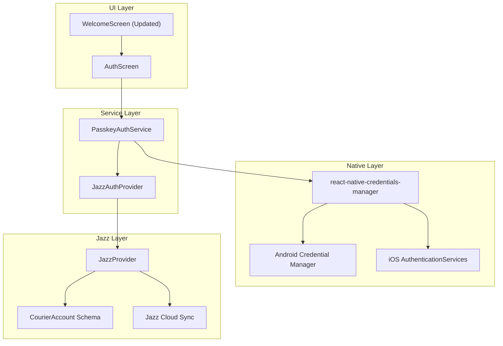
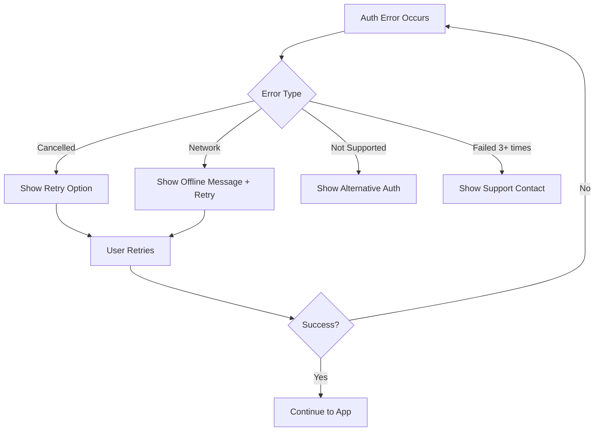

# Design Document: Passkey Authentication with Jazz Tools

## Overview

This design document outlines the architecture and implementation approach for integrating passkey-based authentication into the OpenCourier mobile application. The solution leverages `react-native-credentials-manager` for native passkey operations and Jazz Tools for local-first data management and synchronization.

## Architecture

The authentication system follows a layered architecture that separates concerns between UI, business logic, and native platform interactions.



## Components and Interfaces

### 1. PasskeyAuthService

A service module that handles all passkey-related operations.

```typescript
// src/services/passkeyAuthService.ts

import {
  signUpWithPasskeys,
  signIn,
  signOut,
} from 'react-native-credentials-manager';

interface PasskeyRegistrationResult {
  credentialId: string;
  publicKey: string;
  userId: string;
}

interface PasskeyAuthResult {
  credentialId: string;
  signature: string;
  userId: string;
}

interface PasskeyAuthService {
  // Register a new passkey for account creation
  registerPasskey(username: string): Promise<PasskeyRegistrationResult>;
  
  // Authenticate with existing passkey
  authenticateWithPasskey(): Promise<PasskeyAuthResult>;
  
  // Sign out and clear credential state
  signOutPasskey(): Promise<void>;
  
  // Check if device supports passkeys
  isPasskeySupported(): boolean;
}
```

### 2. JazzAuthProvider

A custom authentication provider that bridges passkey auth with Jazz.

```typescript
// src/providers/JazzAuthProvider.tsx

import React, { createContext, useContext, useState, useEffect } from 'react';
import { JazzProvider } from 'jazz-react-native';
import { CourierAccount } from '../schema';

interface JazzAuthContextType {
  isAuthenticated: boolean;
  isLoading: boolean;
  account: CourierAccount | null;
  signInWithPasskey: () => Promise<void>;
  signUpWithPasskey: (username: string) => Promise<void>;
  signOut: () => Promise<void>;
  error: string | null;
}

const JazzAuthContext = createContext<JazzAuthContextType | null>(null);

export const useJazzAuth = () => {
  const context = useContext(JazzAuthContext);
  if (!context) {
    throw new Error('useJazzAuth must be used within JazzAuthProvider');
  }
  return context;
};
```

### 3. AuthScreen Component

New authentication screen replacing the current Welcome flow.

```typescript
// src/screens/onboarding/Auth/Auth.tsx

interface AuthScreenProps {
  navigation: OnboardingScreenProp<OnboardingScreen.Auth>;
}

// Screen states
type AuthState = 
  | 'idle'
  | 'registering'
  | 'authenticating'
  | 'success'
  | 'error';
```

### 4. Updated App.tsx Structure

```typescript
// App.tsx - Updated structure

const App = () => {
  return (
    <JazzAuthProvider>
      <UserContext.Provider value={...}>
        <NavigationContainer>
          <Router />
        </NavigationContainer>
      </UserContext.Provider>
    </JazzAuthProvider>
  );
};
```

## Data Models

### WebAuthn Request/Response Structures

```typescript
// src/types/passkey.ts

// Registration request sent to authenticator
interface PasskeyRegistrationRequest {
  challenge: string;  // Base64 encoded random bytes
  rp: {
    name: string;     // "OpenCourier"
    id: string;       // Domain for relying party
  };
  user: {
    id: string;       // Unique user identifier
    name: string;     // Username/email
    displayName: string;
  };
  pubKeyCredParams: Array<{
    type: 'public-key';
    alg: number;      // -7 for ES256, -257 for RS256
  }>;
  timeout: number;
  attestation: 'none' | 'indirect' | 'direct';
  authenticatorSelection: {
    authenticatorAttachment?: 'platform' | 'cross-platform';
    residentKey: 'required' | 'preferred' | 'discouraged';
    userVerification: 'required' | 'preferred' | 'discouraged';
  };
}

// Authentication request
interface PasskeyAuthenticationRequest {
  challenge: string;
  rpId: string;
  timeout: number;
  userVerification: 'required' | 'preferred' | 'discouraged';
  allowCredentials?: Array<{
    type: 'public-key';
    id: string;
  }>;
}

// Stored credential reference
interface StoredPasskeyCredential {
  credentialId: string;
  publicKey: string;
  userId: string;
  createdAt: string;
  lastUsedAt: string;
}
```

### Jazz Account Storage

The passkey credential ID will be stored in AsyncStorage and linked to the Jazz account:

```typescript
// Storage keys
const PASSKEY_CREDENTIAL_KEY = '@opencourier/passkey_credential';
const JAZZ_ACCOUNT_ID_KEY = '@opencourier/jazz_account_id';

interface PersistedAuthState {
  credentialId: string;
  jazzAccountId: string;
  username: string;
}
```

## Error Handling

### Error Types and Messages

```typescript
// src/types/authErrors.ts

enum AuthErrorCode {
  PASSKEY_NOT_SUPPORTED = 'PASSKEY_NOT_SUPPORTED',
  REGISTRATION_CANCELLED = 'REGISTRATION_CANCELLED',
  REGISTRATION_FAILED = 'REGISTRATION_FAILED',
  AUTHENTICATION_CANCELLED = 'AUTHENTICATION_CANCELLED',
  AUTHENTICATION_FAILED = 'AUTHENTICATION_FAILED',
  NO_CREDENTIALS_FOUND = 'NO_CREDENTIALS_FOUND',
  NETWORK_ERROR = 'NETWORK_ERROR',
  JAZZ_SYNC_ERROR = 'JAZZ_SYNC_ERROR',
}

interface AuthError {
  code: AuthErrorCode;
  message: string;
  userMessage: string;
  recoverable: boolean;
}

const AUTH_ERROR_MESSAGES: Record<AuthErrorCode, AuthError> = {
  [AuthErrorCode.PASSKEY_NOT_SUPPORTED]: {
    code: AuthErrorCode.PASSKEY_NOT_SUPPORTED,
    message: 'Device does not support passkeys',
    userMessage: 'Your device does not support passkey authentication. Please update your device or use an alternative sign-in method.',
    recoverable: false,
  },
  [AuthErrorCode.REGISTRATION_CANCELLED]: {
    code: AuthErrorCode.REGISTRATION_CANCELLED,
    message: 'User cancelled registration',
    userMessage: 'Registration was cancelled. Tap "Create Account" to try again.',
    recoverable: true,
  },
  // ... other error mappings
};
```

### Error Recovery Flow



## Testing Strategy

### Unit Tests

1. **PasskeyAuthService Tests**
   - Mock `react-native-credentials-manager` functions
   - Test registration request generation
   - Test authentication request generation
   - Test error handling for various failure scenarios

2. **JazzAuthProvider Tests**
   - Test context state management
   - Test authentication flow state transitions
   - Test account creation and loading

### Integration Tests

1. **Auth Flow Tests**
   - Test complete registration flow (mocked native layer)
   - Test complete authentication flow (mocked native layer)
   - Test sign-out flow

2. **Navigation Tests**
   - Test navigation from Landing to Auth screen
   - Test navigation from Auth to Main app on success
   - Test error state navigation

### Manual Testing Checklist

- [ ] Passkey registration on Android (API 28+)
- [ ] Passkey registration on iOS (16.0+)
- [ ] Passkey authentication on Android
- [ ] Passkey authentication on iOS
- [ ] Cancel registration flow
- [ ] Cancel authentication flow
- [ ] Network error during registration
- [ ] Network error during authentication
- [ ] App restart with existing passkey
- [ ] Sign out and sign back in

## File Structure

```
src/
├── providers/
│   └── JazzAuthProvider.tsx          # New: Jazz auth context provider
├── services/
│   └── passkeyAuthService.ts         # New: Passkey operations service
├── screens/
│   └── onboarding/
│       ├── Auth/
│       │   ├── Auth.tsx              # New: Main auth screen
│       │   └── Auth.styles.ts        # New: Auth screen styles
│       ├── Landing/
│       │   └── Landing.tsx           # Modified: Navigate to Auth
│       └── Welcome/
│           └── Welcome.tsx           # Modified: Add passkey options
├── types/
│   ├── passkey.ts                    # New: Passkey type definitions
│   └── authErrors.ts                 # New: Auth error types
├── hooks/
│   └── usePasskeyAuth.ts             # New: Passkey auth hook
├── navigation/
│   └── onboarding/
│       ├── OnboardingNavigation.tsx  # Modified: Add Auth screen
│       └── types.ts                  # Modified: Add Auth screen type
└── App.tsx                           # Modified: Wrap with JazzAuthProvider
```

## Implementation Notes

### Platform-Specific Considerations

**Android:**
- Requires `minSdkVersion` 24+ for basic credential storage
- Passkey support requires API 28+ (Android 9.0)
- Uses Credential Manager API via `react-native-credentials-manager`
- Google Sign-In available as fallback

**iOS:**
- Requires iOS 16.0+ for passkey support
- Uses AuthenticationServices framework
- Apple Sign-In available as fallback
- Requires Associated Domains entitlement for WebAuthn

### Jazz Integration Details

1. **Account Creation**: When a passkey is registered, create a new Jazz account using the credential ID as a unique identifier
2. **Session Persistence**: Store the Jazz account ID alongside the passkey credential ID in AsyncStorage
3. **Session Restoration**: On app launch, check for stored credentials and restore the Jazz session
4. **Sync Configuration**: Use `when: 'signedUp'` to only sync after successful authentication

### Security Considerations

1. **Challenge Generation**: Use cryptographically secure random bytes for challenges
2. **Credential Storage**: Never store private keys; only store credential IDs and public keys
3. **Transport Security**: All communication with Jazz Cloud uses WSS (WebSocket Secure)
4. **Biometric Protection**: Passkeys are protected by device biometrics/PIN
